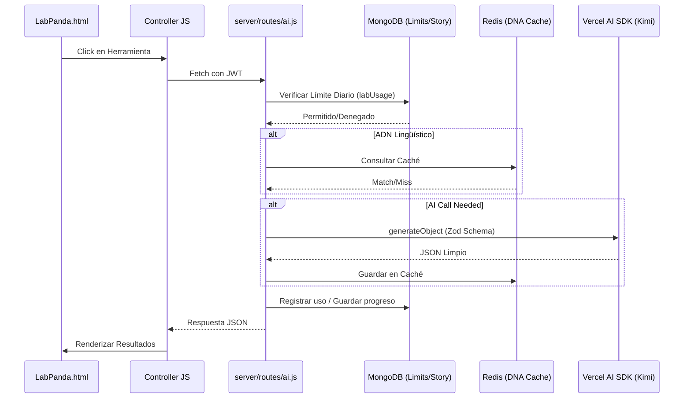

# Walkthrough: Optimización de LabPanda 🐼

Se ha completado el refactor integral del Laboratorio Panda para mejorar la seguridad, confiabilidad y rendimiento.

## Mejoras Implementadas

### Backend (Node.js/Express)
- **JSON Robusto (Nivel Máximo)**: Se migró el 100% de los endpoints que devuelven JSON (incluyendo WOD y Traducción) a `generateObject`. Esto garantiza que la estructura de datos sea siempre correcta.
- **Grading con Sentido**: El sistema de calificación de oraciones (`grade-sentence`) ahora entrega un análisis gramatical profundo, notas de vocabulario y consejos pedagógicos personalizados, no solo una nota numérica.
- **StoryLab Blindado**: La persistencia de historias ahora tiene fallback automático: si Redis falla, el sistema recupera la sesión desde MongoDB sin que el usuario note nada.
- **Skill de Desarrollo**: Se creó [.agent/skills/pandalatam/SKILL.md](file:///home/aledls/Projects/ODL/ChinoStandardS/.agent/skills/pandalatam/SKILL.md). Este es el "manual de instrucciones" para que yo (o cualquier otro agente) sepa exactamente cómo programar en este proyecto sin desviarse de los estándares (Zod, Groq, Backend limits).

### Frontend (Vanilla JS)
- **Autenticación Centralizada**: Se actualizaron todos los controladores ([lab-dna.js](file:///home/aledls/Projects/ODL/ChinoStandardS/src/js/lab-dna.js), [lab-exams.js](file:///home/aledls/Projects/ODL/ChinoStandardS/src/js/lab-exams.js), [lab-analysis.js](file:///home/aledls/Projects/ODL/ChinoStandardS/src/js/lab-analysis.js), [lab-story.js](file:///home/aledls/Projects/ODL/ChinoStandardS/src/js/lab-story.js)) para incluir los headers JWT en todas las peticiones.
- **Manejo de Errores**: Se mejoró la captura de errores para mostrar mensajes descriptivos cuando se alcanza el límite diario (error 429).

## Esquema Técnico del Flujo

## Verificación de Memoria
Se ha guardado el conocimiento arquitectónico en Engram bajo el título **"Flujo de LabPanda"**.
